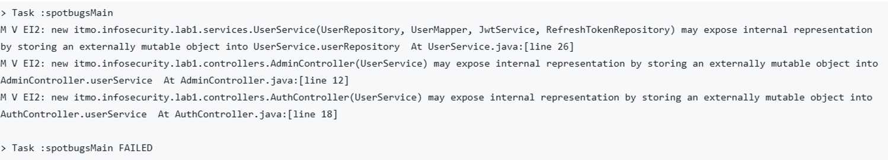
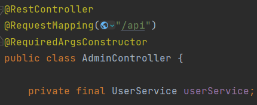
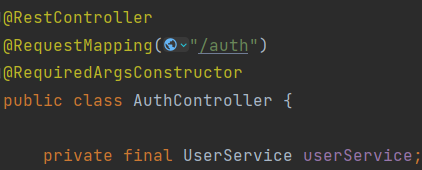
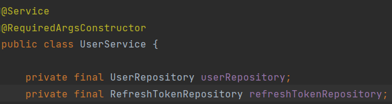
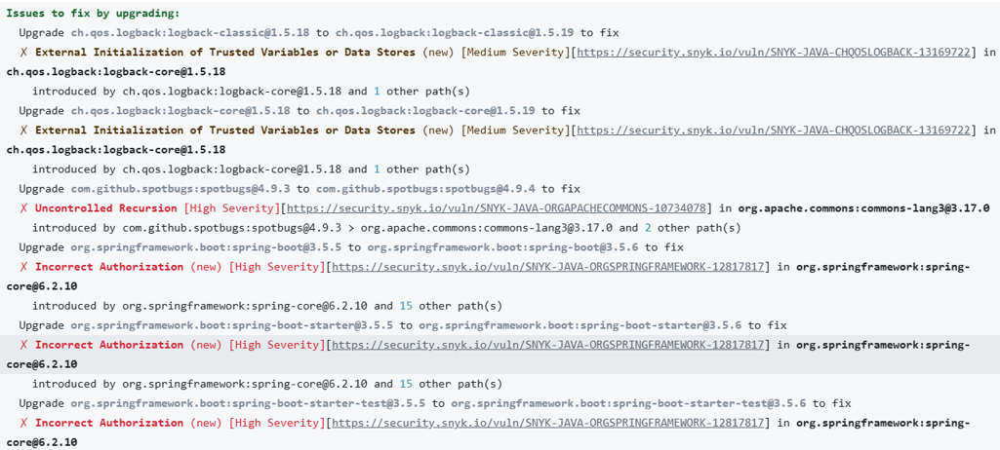
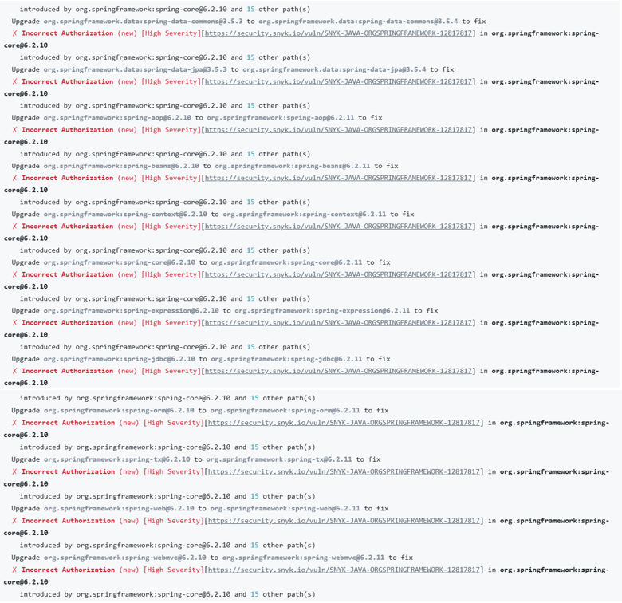

### Описание проекта

Проект выполнен на языке Java с использованием фреймворка Spring Boot.

Список эндпоинтов:

- `POST /auth/registration` – регистрация пользователя. Требует наличие тела запроса в виде:
```
{
 "email": "ivan@ya.ru",
 "nickname": "IvanTarasov",
 "password": "123456"
}
```
Возвращает токен аутентификации
```
{
 "token": “<access token>”
}
```
Возвращает код 401, если пользователь с такой почтой уже существует.

- `POST /auth/login` – авторизация пользователя. Требует наличие тела запроса в виде:
```
{
 "email": "ivan@ya.ru",
 "nickname": "IvanTarasov",
 "password": "123456"
}
```
Возвращает токен аутентификации
```
{
 "token": “<access token>”
}
```
   Возвращает код 401, если в теле указан неверный логин или пароль.

- `GET /auth/refreshToken` – обновление токена аутентификации в случае истечения его срока жизни. Требует наличие заголовка “Authorization”: “Bearer <access token>”.
   Возвращает обновлённый токен аутентификации
```
{
 "token": “<access token>”
}
```
Возвращает код 401, если истек срок жизни refresh токена или в случае повреждения информации о почте в access токене.
- `GET /api/data` – возвращает список всех пользователей. Требуется авторизация!
   
Тело ответа:
```
[
   {
   "email": "ivan@ya.ru",
   "nickname": "IvanTarasov"
   },
   {
   "email": "user@example.ru",
   "nickname": "UserName"
   },
   …
 ]
   ```

- `DELETE /api/delete-user-by-email/{email}` – удаляет пользователя по его почте. Требуется авторизация! Требуется указать в url адрес почты, например, `/api/delete-user-by-email/user@example.ru`. Данный эндпоинт ничего не возвращает в теле ответа.

### Реализация защит

*SQL-инъекции*

Защита от SQL-инъекций происходит благодаря фреймворку Spring Data JPA, который под капотом 
использует Hibernate. Если бы на backend использовались голые запросы и параметры передавались 
бы строковой конкатенацией, например, `select * from users where email= + ’test@example.com’ `
то можно было бы выполнить уязвимый запрос, который возвращал бы всех пользователей, 
даже несмотря на то, что почты test@example.com не существует, например вот так

`select * from users where email=’test@example.com’ or 1=1;`

Условие 1=1 всегда истина.
Hibernate же не использует строковую конкатенацию. Параметры передаются, как bind-параметры. 
То есть фактически выполняется `select * from users where email = ?`. Значение email подставляется
отдельным параметром, а не как часть строки SQL.

*XSS-атака*

Так как я использую RestController’ы, соответственно, эти контроллеры возвращают данные в 
виде JSON, а не HTML. Даже если поле содержит `<script>alert(1)</script>`, оно будет 
сериализовано так:
```
{
"name": "<script>alert(1)</script>"
}
```
Браузер, получив JSON по Content-Type: application/json, не будет интерпретировать содержимое 
как HTML/JS, а просто как данные. Чтобы XSS случился, нужно было бы отрендерить эти данные в
HTML без экранирования (например, вставить их в innerHTML).

*Защита с помощью jwt-токенов*

JWT (JSON Web Token) — это стандартизированный формат токена, который используется 
для безопасной передачи информации между сторонами в виде JSON-объекта. Состоит из трех частей, 
разделенных точками: **Заголовок.Полезная нагрузка.Сигнатура**. Заголовок обычно содержит 
информацию о типе токена и используемом алгоритме подписи.
```
{
"alg": "HS256",
"typ": "JWT"
}
```
Полезная нагрузка содержит данные о пользователе, срок действия, права и т.д.

Сигнатура создаётся с помощью алгоритма (например, HMAC SHA-256) и секретного ключа или 
приватного ключа.Подпись гарантирует, что токен не был изменён.

Различают два вида jwt токена: access и refresh токены. Access токен выдает право выполнять 
запросы к API. Его срок жизни составляет 5-15 минут и хранится на клиенте. Refresh токен 
используется для обновления access токена. Срок действия составляет один или несколько дней
и хранится в http-only куках или в базе данных.

Перед тем как попасть на эндпоинты, которые требуют авторизации, происходит валидация jwt 
access токена в фильтре. Если токен не валиден, возвращается код 403. Затем требуется обновление
токена, используя refresh токен, или повторная авторизация в случае его невалидности.

### Статический анализатор кода SAST

После тестирования своей программы мною был запущен SAST анализатор. Были выведены следующие 
предупреждения:



Эти предупреждения связаны с тем, что Spring внедряет и управляет полями, которые аннотированы 
как `@Service` или `@Repository`. 







Однако с точки зрения архитектуры приложений Spring Boot это является нормальной практикой. 
И поэтому я считаю, что эти предупреждения ложны. Чтобы spotBugs их игнорировал, я создал 
файл `spotbugs-exclude.xml` с содержимым:
```xml
<?xml version="1.0" encoding="UTF-8"?>
<FindBugsFilter>
    <Match>
        <Package name="itmo.infosecurity.lab1.controllers"/>
        <Bug code="EI2"/>
    </Match>
    <Match>
        <Package name="itmo.infosecurity.lab1.services"/>
        <Bug code="EI2"/>
    </Match>
</FindBugsFilter>
```
А также добавил в фильтр этот файл в build.gradle:
```
spotbugs {
    excludeFilter = file("spotbugs/spotbugs-exclude.xml")
}
```

### Проверка зависимостей с использованием Snyk

При первом запуске Snyk было выведено очень много ошибок:




Исправить проблемы удалось, обновив зависимости:
1)	Spring 3.5.5 -> **3.5.6**
2)	Переопределение зависимостей
```
implementation 'ch.qos.logback:logback-classic:1.5.19'
implementation 'ch.qos.logback:logback-core:1.5.19' 
```
